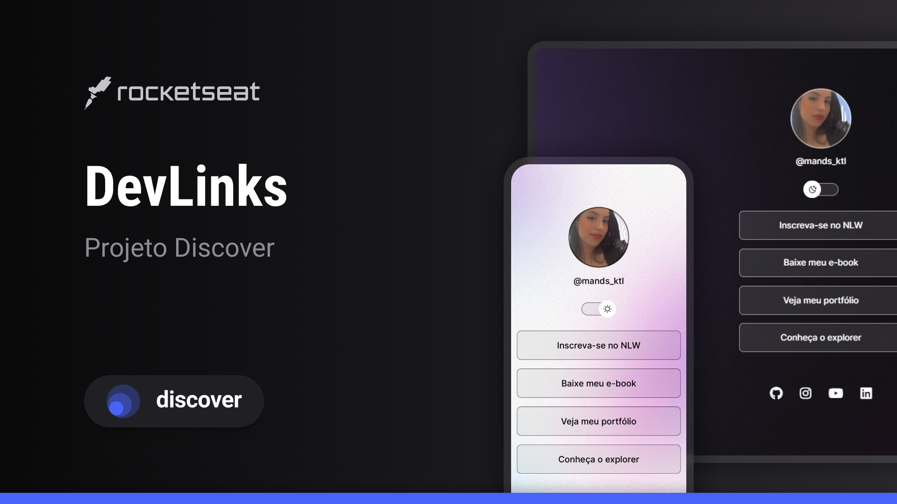

## 🚀 Tecnologias

Esse projeto foi desenvolvido com as seguintes tecnologias:

- HTML e CSS
- JavaScript
- Git e Github
- Figma

## 💻 Projeto

O DevLinks é um agregador de links para usar como cartão de visitas online.

## 🏷️ Layout

Você pode visualizar o layout do projeto através
[desse link](https://www.figma.com/file/y9rYSSUuUv1cySjG1Om9ZL/DevLinks-%E2%80%A2-Projeto?type=design&node-id=10%3A620&mode=design&t=gr1WJYmhmK6QUW0i-1).
É necessário ter uma conta no [figma](https://www.figma.com)
